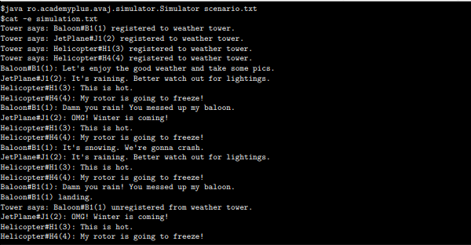

# avaj-launcher
Java-based aircraft simulation program that models weather effects on different aircraft types.

# Tools
- Java version 24

# Quick start
```bash
$> git clone [https://github.com/nabitbol/avaj-launcher.git](https://github.com/nabitbol/avaj-launcher.git)
$> cd src Make run
```

# In depth usage
> If not available, create your custom scenario at the root of the project to be used in the `make run`
> and `make runBonus` rules of the Makefile. Please name it `scenario.txt`.

### Output example



## Run for correction
```bash
$> git clone [https://github.com/nabitbol/avaj-launcher.git](https://github.com/nabitbol/avaj-launcher.git)
$> cd src
$> javac Simulation.java
$> java Simulation <path_to_your_scenario.txt>
```
## Run bonus
```bash
$> git clone [https://github.com/nabitbol/avaj-launcher.git](https://github.com/nabitbol/avaj-launcher.git)
$> cd src Make runBonus
```

# Good to know
This project aims to teach the basics of the Java programming language. To make this project, only the standard library is allowed; no code generation tools such as protoc for Protocol Buffers or package managing tools like Maven or Gradle aren't allowed.

Also, this project requests to build two classes following the singleton pattern, which nowadays is considered an anti-pattern and its usage has started to decline in Java community. To learn more about ['Singleton as an anti-pattern click here.'](https://www.michaelsafyan.com/tech/design/patterns/singleton).

This project use other patterns:
- Observer pattern ['learn more'](https://en.wikipedia.org/wiki/Observer_pattern)
- Factory pattern ['learn more'](https://en.wikipedia.org/wiki/Factory_method_pattern)
- Builder pattern used by the `HttpRequest.newBuilder()` method ['learn more'](https://en.wikipedia.org/wiki/Builder_pattern)


Beside added method and attribut which is allowed by the subject. I decided to make on one change on the diagram, is the return value from the `AircraftFactory`
It make more sens for me that `AircraftFactory` throw `Aircraft` than `Flyable`.


# Roadmap

## Mandatory
- [x] Implement data structures according to the UML diagram provided by the subject.
- [x] Implement the simulation algorithm.
- [x] Parse the input file describing the simulation:
    - [x] The number of iterations.
    - [x] The type of aircraft and their coordinates.
- [x] Package the project.

## Bonus
- [x] Create your own custom exceptions for treating abnormal behavior.
My bonus
- [x] Incorporate a Makefile to build the project.
- [ ] Parallelize the simulation:
    - [ ] Add thread safety to the singletons.
- [x] Get weather from the weather API. (api.open-meteo.com)
- [ ] Add a UI to the simulation
- [ ] Add the ability to insert custom weather configuration with logs
